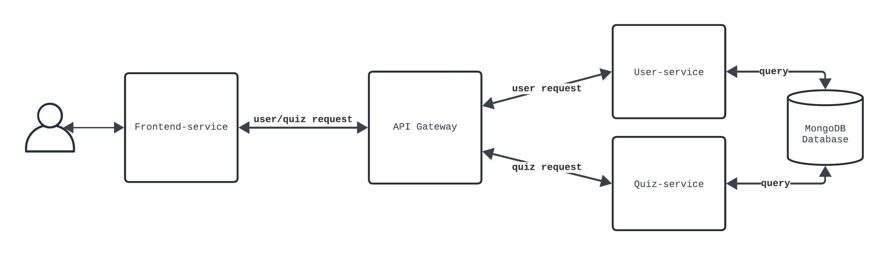

# Quiz application
### Assignment: Build Something
    

Quiz App is a web application designed for posting and discovering quizzes. Its purpose is to provide quiz enthusiasts with a centralized source for finding quizzes in their city, while also allowing quiz hosts, such as restaurants or event organizers, to share details about the location, theme, time, and other relevant information. The idea is to have a page where users can view upcoming quizzes, as well as the option to sign in and add new quizzes.

The quiz application is built using microservices, comprising four core services and a database.

##### Frontend service
The frontend service allows users to interact with the application's functionalities, such as viewing quizzes, creating quizzes, logging in and out, and creating accounts. 
##### API Gateway

The API Gateway manages traffic for various requests and can be expanded in the future to include additional routes to different microservices. The gateway service will route for exampel user-related requests to the user service, and quiz related requests to quiz service.

##### User Service

 The user service which handles user actions/behaviour like logging in, logging out, and account creation. In future expansions, this user service may be connected to a separate database and handle other user-related behaviors. 

##### Quiz Service

Similarly, the quiz service is responsible for processing quiz-related requests, such as retrieving and creating quizzes. Future versions of this service may include additional functionalities, like retrieving quizzes from different categories and accessing specific items.

##### Design 
The architectural design offers the benefit of allowing service expansion with minimal to no refactoring of other services. The routing/API Gateway manages additional services in the future and provides the frontend with a single point of entry. This approach simplifies client-side logic and reduces the number of requests needed for interaction. Furthermore, the gateway can distribute incoming traffic across multiple instances of a service, enhancing both performance and availability.

From a security standpoint, the API Gateway serves as a secure buffer, concealing the internal microservices architecture and reducing exposure to overall system.  The gateway can also offers features such as throttling and rate limiting, which help prevent abuse, denial-of-service attacks, and unauthorized access. By logging all traffic centrally, the API Gateway facilitates effective monitoring and auditing, and can facilitate for the quick detection of anomalies while enhancing data privacy.

However, there are potential drawbacks, such as the risk of a single point of failure. The application is particularly vulnerable at the API Gateway. If it fails to scale or goes down, the entire application becomes unusable. While it can act as a performance bottleneck, this issue can be mitigated through horizontal scaling. Another advantage of this design is that it ensures a clear separation of concerns in communication between services. Additionally, the API Gateway’s security measures help contain failures, meaning that if one service goes down, it does not necessarily affect the entire system or expose other services to increased risk.